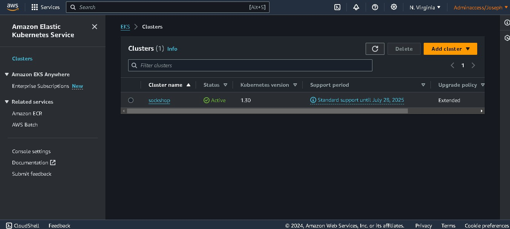
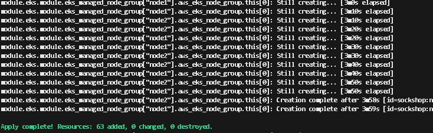
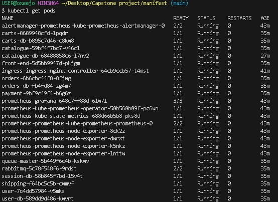
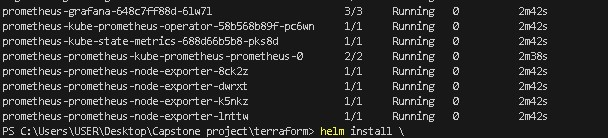
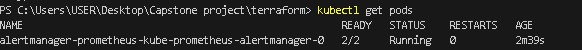

# CAPSTONE PROJECT

# Objective

  We aim to deploy a microservices-based application, specifically the Socks Shop, using a modern approach that emphasizes automation and efficiency. The goal is to use Infrastructure as Code (IaaC) for rapid and reliable deployment on Kubernetes.

Tasks:

* Deploying pipeline using Amazon EKS (Elastic Kubernetes Service)
     
     

* Using Terraform as the configuration management tool

     
     
     

* The application running on Kubernetes
  
  
  

* Using Prometheus as a monitoring tool
  
  
  

* Metrics Alertmanager

   

* Monitoring Grafana

* Logging Prometheus

[subscribe](https://www.youtube.com/@SaintNaki)
